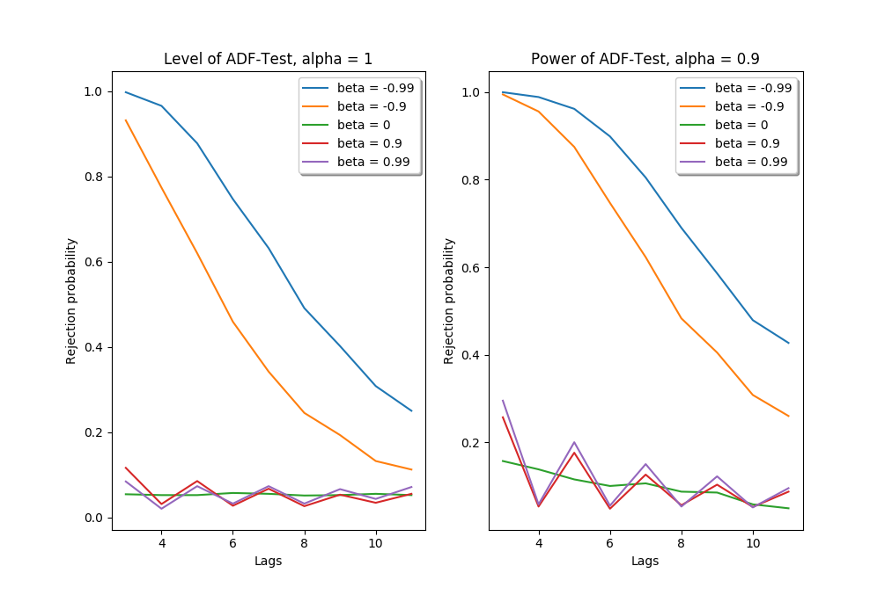

[](http://quantlet.de/)

## [](http://quantlet.de/) **SFEAdfPower** [](http://quantlet.de/)

```yaml

Name of Quantlet: SFEAdfPower

Published in: 'Statistics of Financial Markets I'

Description: 'Simulation study for the power and level of the Augmented Dickey-Fuller Test for different AR- and MA-parameters as well as different number of lags.'

Keywords: 'ADF, time series, stationary, Augmented Dickey-Fuller, unit root, test, power, level, simulation'

Author: 'Lucas Umann, Julian Schneider'

Input: 'Number of simulations, length of simulated time series, AR- and MA- coefficients'

Output: 'Graphs for the power and level of the ADF-test, table of results for smallest and largest lags.'

```



### PYTHON Code
```python

# Required Packages
import numpy as np
import matplotlib.pyplot as plt
from prettytable import PrettyTable
from statsmodels.tsa.stattools import adfuller
from statsmodels.tsa.arima_process import arma_generate_sample

np.random.seed(0)

#   ~~~~~Input parameters~~~~~
# number of simulations:
number_simulations = 1000

# length of time series:
length_ts = 1000

# Alpha-coefficients for AR(1)
alpha_coeff = [1, 0.9]

# Beta-coefficients for MA(1)
beta_coeff = [-0.99, -0.9, 0, 0.9, 0.99]

# Minimum and maximum of lags
lagstart = 3
lagend = 11
numberlags = lagend - lagstart + 1

# Significance level of test
sig_level = 0.05

# Type of ADF-test
#       'c'     ----> constant only
#       'ct'    ----> constant and trend
#       'ctt'   ----> constant, linear and quadratic trend
#       'nc'    ----> no constant, no trend
model = 'ctt'


# Function that generates the specified number of simulations for an ARMA-Process of the specified length
# alpha and beta are the coefficients for the autoregressive and moving average processes
def generate_arma_simulations(alpha, beta):
    # Check if inputs are valid
    if number_simulations == 0:
        print("Warning: Specify a valid number of simulations.")
    elif alpha == 0 and beta == 0:
        print("Warning: Specify valid coefficients for the ARMA model")
    elif length_ts == 0 or length_ts == 1:
        print("Warning: Specify a valid length for the time series.")
    # Simulate data
    else:
        ar_params = np.r_[1, -alpha]
        ma_params = np.r_[1, beta]
        t_series = np.zeros([number_simulations, length_ts])
        a = 0
        while a < number_simulations:
            t_series[a, ::] = arma_generate_sample(ar_params, ma_params, length_ts)
            a = a + 1
        return t_series


# Function that calculates the p-values for the simulated data
def calculate_adf(data, lag):
    if lag < 1:
        print("Warning: Specify a positive integer for the amount of lags to be used.")
    else:
        data_shape = np.shape(data)
        data_rows = data_shape[0]
        pvalues = np.zeros(data_rows)
        k = 0
        while k < data_rows:
            pvalues[k] = adfuller(data[k, ::], maxlag=lag, regression=model, autolag=None)[1]
            k = k + 1
        return pvalues


# Function that calculates the probability of the rejection test-decision
def calculate_rejection_probability(data, lag):
    adf_pvalues = np.zeros(number_simulations)
    adf_decisions = np.zeros(number_simulations)
    adf_pvalues[::] = calculate_adf(data, lag)
    adf_decisions[adf_pvalues < sig_level] = 1
    adf_decisions_mean = np.mean(adf_decisions)
    return adf_decisions_mean


# Creates the array of results
def create_results_table():
    rej_prob = np.ones((len(alpha_coeff), numberlags, len(beta_coeff)))
    j = 0
    while j < len(alpha_coeff):
        k = 0
        while k < len(beta_coeff):
            simulated_data = generate_arma_simulations(alpha_coeff[j], beta_coeff[k])
            l = 0
            while l < lagend - lagstart + 1:
                rej_prob[j, l, k] = calculate_rejection_probability(simulated_data, lagstart + l)
                l = l + 1
            k = k + 1
        j = j + 1
    return rej_prob


# Extracts only the results for the first and last lag
def summary_first_last_lag(complete_table):
    table_lagstart_lagend = np.zeros((len(alpha_coeff), 2, len(beta_coeff)))
    table_lagstart_lagend[::, 0, ::] = complete_table[::, 0, ::]
    table_lagstart_lagend[::, 1, ::] = complete_table[::, -1, ::]
    return table_lagstart_lagend


# Call main functions for computation of results
results = create_results_table()
results_short = summary_first_last_lag(results)

# Create and visualize tables of results
powertable = PrettyTable()
powertable.field_names = ["alpha", "lags", "beta =" + str(beta_coeff[0]),
                          "beta = " + str(beta_coeff[1]), "beta = " + str(beta_coeff[2]),
                          "beta = " + str(beta_coeff[3]), "beta = " + str(beta_coeff[4])]
powertable.add_row([alpha_coeff[0], lagstart, results[0, 0, 0], results[0, 0, 1], results[0, 0, 2], results[0, 0, 3],
                    results[0, 0, 4]])
powertable.add_row(
    [" ", lagend, results[0, 1, 0], results[0, 1, 1], results[0, 1, 2], results[0, 1, 3], results[0, 1, 4]])
print(powertable)

leveltable = PrettyTable()
leveltable.field_names = ["alpha", "lags", "beta =" + str(beta_coeff[0]),
                          "beta = " + str(beta_coeff[1]), "beta = " + str(beta_coeff[2]),
                          "beta = " + str(beta_coeff[3]), "beta = " + str(beta_coeff[4])]
leveltable.add_row([alpha_coeff[1], lagstart, results[1, 0, 0], results[1, 0, 1], results[1, 0, 2], results[1, 0, 3],
                    results[1, 0, 4]])
leveltable.add_row(
    [" ", lagend, results[1, 1, 0], results[1, 1, 1], results[1, 1, 2], results[1, 1, 3], results[1, 1, 4]])
print(leveltable)

# Create plots of results
x = range(lagstart, lagend + 1)

# Creates the plot for level of test
plt.subplot(1, 2, 1)
i = 0
while i < len(beta_coeff):
    plt.plot(x, results[0, ::, i], label="beta = " + str(beta_coeff[i]))
    i = i + 1
plt.title("Level of ADF-Test, alpha = 1")
plt.xlabel("Lags")
plt.ylabel("Rejection probability")
plt.legend(loc='upper right', fancybox=True, shadow=True)

# Creates the plot for power of test
plt.subplot(1, 2, 2)

i = 0
while i < len(beta_coeff):
    plt.plot(x, results[1, ::, i], label="beta = " + str(beta_coeff[i]))
    i = i + 1
plt.title("Power of ADF-Test, alpha = 0.9")
plt.xlabel("Lags")
plt.ylabel("Rejection probability")
plt.legend(loc='upper right', fancybox=True, shadow=True)

plt.show()

```

automatically created on 2020-02-13