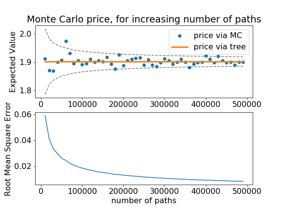
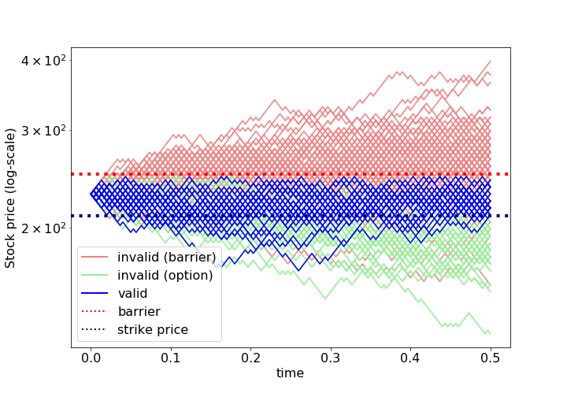

[](http://quantlet.de/)

## [](http://quantlet.de/) **SFEBarrier_Pricing_MC** [](http://quantlet.de/)

```yaml

Name of QuantLet: SFEBarrier_Pricing_MC

Published in: Statistics of Financial Markets

Description: 'Computes Barrier option prices using Monte Carlo method for assets with/without continuous dividends. barrier option types: up-and-out, up-and-in, down-and-out, down-and-in'

Keywords: 'binomial, Monte-Carlo, asset, option, option-price, barrier-option, up-and-out, up-and-in, down-and-out, down-and-in'

See also: SFEdown-and-out, SFEBarrier, SFEBarrier_Pricing_Tree

Author: Franziska Wehrmann

Submitted: Thu, January 30 2020 by Franziska Wehrmann

Input: 
- S0 : current stock price
- K : strike price
- T : time to maturity
- sigma : volatility
- r : interest rate
- div : dividend
- N : number of steps in the tree
- B : barrier
- option : call or put
- barrier_type : up/down and in/out

Output: price of option, plot of monte carlo paths

```





### PYTHON Code
```python

import numpy as np 
from scipy.stats import bernoulli
import matplotlib.pyplot as plt
plt.rcParams.update({'font.size': 16})
from matplotlib.lines import Line2D

def calc_parameters(T, N, sigma, r, div):
    """
    Calculates the dependent parameters of the Binomial Tree (CRR)
    input:
      T     : time to maturity
      N     : number of steps of the tree
      sigma : volatility
      r     : interest rate 0.05 = 5%
      div   : dividend 0.03 = 3%
    output: 
      dt    : size of time step
      u     : factor of upwards movement of stock
      d     : factor of downwards movement of stock
      q     : risk-neutral probability
      b     : cost of carry
    """
    dt = T/N
    u = np.exp(sigma*np.sqrt(dt))
    d = 1/u
    b = r-div
    q = 1/2 + 1/2 * (b - 1/2 * sigma**2)*np.sqrt(dt)/sigma # P(up movement)
    return(dt, u, d, q, b)

def sample_paths(S0, N, u, d, q, M):
    """
    samples M stock paths of the Binomial Tree (CRR)
    input:
      S0, N, u, d, q : parameters of the Binomial Tree as described
              in calc_parameters
      M     : amount of paths to sample
    output:
      paths : (M, N+1) array with M sample paths of 
              N steps (+1 for position at t=0)
    """
    value = S0*np.ones((M,1)) # M sample paths at once
    paths = np.zeros((M, N+1))
    paths[:,0] = value[:,0]
    for i in np.arange(1, N+1,1): # time steps
        random_values = bernoulli.rvs(size=(M,1),p=q)
        up_moves = random_values*u
        down_moves = -1*(random_values-1)*d 
        value = np.multiply(value,up_moves+down_moves)
        paths[:,i] = value[:,0]
    return paths

def valid_barrier_type(paths, barrier_type, B):
    """
    Determines which paths are not knocked out from barrier:
    input:
      paths  : (M,N+1) array of M sample paths with N timesteps
      B      : Barrier value
      barrier_type : 'up-and-out', 'down-and-out', 'up-and-in', 'down-and-in'
    output:
      p_valid   : paths that are valid according to barrier_type and B
      idx       : index of paths that are valid
    """
    
    if barrier_type == 'up-and-out':
        # keep "always smaller than barrier"
        mask = ((paths > B)).sum(axis=1)  #True=1, False=0
        idx = np.where(mask == 0)  # where always False, it was never > B
        p_valid = paths[idx]
    elif barrier_type == 'down-and-out':
        # keep "always bigger than barrier"
        mask = ((paths < B)).sum(axis=1)  #True=1, False=0
        idx = np.where(mask == 0)  # where always False, it was never > B
        p_valid = paths[idx]    
    elif barrier_type == 'up-and-in':
        # keep "at least once bigger than barrier"
        mask = ((paths > B)).sum(axis=1)  #True=1, False=0
        idx = np.where(mask != 0)  # where at least once True
        p_valid = paths[idx]    
    elif barrier_type == 'down-and-in':
        # keep "at least once smaller than barrier"
        mask = ((paths < B)).sum(axis=1)  #True=1, False=0
        idx = np.where(mask != 0)  # where at least once True
        p_valid = paths[idx] 
    
    return p_valid, idx
    
    
def split_paths(paths, B, K, barrier_type, option):
    """
    Splits the sample paths in 3 groups
    input:
      paths     : (M,N+1) array of M sample paths with N timesteps
      B         : Barrier value
      K         : Strike price
      barrier_type : 'up-and-out', 'down-and-out', 'up-and-in', 'down-and-in'
      option    : 'Call', 'Put'
    output:
      p_valid   : paths that are valid according to barrier_type and B
      p_invalid : paths that got knocked out from barrier 
                  (complement of p_valid)
      p_counts  : paths that are also executed by option (subset of p_valid)
                  those are the paths that do not get value=0 for pricing
    """

    # valid, not knocked out by barrier_type with B
    p_valid, idx = valid_barrier_type(paths, barrier_type, B)
    
    # invalid, complement of p_valid
    valid_indices = set(idx[0])
    all_indices_set = set(np.arange(0,paths.shape[0]))
    invalid_indices = all_indices_set.difference(valid_indices)
    p_invalid = paths[list(invalid_indices)]

    # option is exercised, subset of p_valid
    if option =='Call':
        p_counts = p_valid[list((p_valid[:,-1] > K))]
    elif option =='Put':
        p_counts = p_valid[list((p_valid[:,-1] < K))]
    
    return p_valid, p_invalid, p_counts

def calc_price(p_counts, K, r, T, M, option):
    """
    Calculates the option price. 
    input:
      p_counts  : subset of paths that did not get knocked out 
                  by barrier or strike price 
      r, T      : parameters of the Binomial Tree
      K, option : 'Call' or 'Put' option with strike price K   
    output:
      price     : price of option, 
                  0 if p_counts was empty set
    """
    if p_counts.shape[0] == 0:  # not possible to exercise any option
        return(0)
    if option == 'Call':
        price = np.mean(p_counts[:,-1]-K)*np.exp(-1*r*T)*(p_counts.shape[0]/M)
    elif option == 'Put':
        price = np.mean(K-p_counts[:,-1])*np.exp(-1*r*T)*(p_counts.shape[0]/M)
    return price


def sample_and_plot(S0, K, B, T, N, u, d, q, M, barrier_type):
    """
    Creates a plot of M sample paths where the color indicates in which
    way the path contributes to the calculation of the option price
    input:
      S0, T, N, u, d, q : parameters of the Binomial Tree (CRR) Model
                          as in function calc_parameters   
      B            : Barrier 
      M            : amount of sample paths (recommend around 200)
      barrier_type : 'up-and-out', 'down-and-out', 'up-and-in', 'down-and-in'
      option, K    : 'Call' or 'Put' option with strike price K
    """
    paths = sample_paths(S0, N, u, d, q, M)
    p_valid, p_invalid, p_counts = split_paths(paths, B, K, 
                                               barrier_type, option)

    times = np.linspace(0, T, N+1)

    fig = plt.figure(figsize=(10,7))
    ax1 = plt.subplot2grid((1,1),(0,0))
    ax1.set_ylabel('Stock price (log-scale)')
    ax1.set_xlabel('time')
    for path in p_invalid:
        ax1.plot(times, path, c='lightcoral')
    for path in p_valid:
        ax1.plot(times, path, c='grey')
    for path in p_counts:
        ax1.plot(times, path, c='blue')
    
    custom_lines = [Line2D([0], [0], c='lightcoral', lw=2),
                    Line2D([0], [0], c='grey', lw=2),
                    Line2D([0], [0], c='blue', lw=2), 
                    Line2D([0], [0], c='red', ls=':', lw=2), 
                    Line2D([0], [0], c='navy', ls=':', lw=2)]
    
    ax1.axhline(y=K, lw=4, c = 'navy', ls = ':', label = 'Strike Price')
    ax1.axhline(y=B, lw=4, c = 'red', ls = ':', label = 'Barrier')
    
    plt.yscale('log') 
    ax1.legend(custom_lines, ['invalid (barrier)', 'invalid (option)', 'valid', 
                              'barrier', 'strike price'])
    #plt.savefig('up-and-out_call.png', transparent=True)
    plt.show()

def variations_plot(S0, K, B, T, N, u, d, q, M, barrier_type, option, 
                    MC_runs, price_tree):
    """
    Creates a plot which shows the statistical nature of the Monte Carlo Method.
    Less variation in outcomes with higher sample size.
    input:
      S0, T, N, u, d, q : parameters of the Binomial Tree (CRR) Model
                          as in function calc_parameters   
      B            : Barrier 
      M            : amount of sample paths, is scaled up later 
                     (recommend around 10000)
      barrier_type : 'up-and-out', 'down-and-out', 'up-and-in', 'down-and-in'
      option, K    : 'Call' or 'Put' option with strike price K
      MC_runs      : maximum factor for paths Mi = i*M for i in range(0,MC_runs)
      price_tree   : option price as calculated with a Binomial Tree 
                     (SFEBarrier_Pricing_Tree)
    """
    x_values = []
    pi_M = []
    pi_M_RMSE = []
    for i in range(1,MC_runs,1):
        Mi=M*i
        x_values.append([Mi])
        paths = sample_paths(S0, N, u, d, q, Mi)
        p_valid, p_invalid, p_counts = split_paths(paths, B, K, 
                                                   barrier_type, option)
        if option == 'Call':
            payoffs = np.maximum(0,p_counts[:,-1]-K)*np.exp(-1*r*T)
        elif option == 'Put':
            payoffs = np.maximum(0,K-p_counts[:,-1])*np.exp(-1*r*T)
        payoffs = list(payoffs)
        while len(payoffs) < Mi:
            payoffs.append([0])
        mean_payoff = np.mean(payoffs)[0]
        pi_M.append(mean_payoff)
        RMSE = np.sqrt(np.var(payoffs,ddof=1))/np.sqrt(Mi)
        pi_M_RMSE.append(RMSE[0])
    
    # plotting
    plt.figure(figsize=(8,6))
    plt.subplot(2, 1, 1)
    plt.plot(x_values, price_tree-1.96*np.array(pi_M_RMSE), '--', c='grey')
    plt.plot(x_values, price_tree+1.96*np.array(pi_M_RMSE), '--', c='grey')
    plt.plot(x_values, pi_M, 'o', label='price via MC')
    plt.plot(x_values, [price_tree]*len(x_values), '-', lw=3, 
             label='price via tree')
    plt.legend()
    plt.title('Monte Carlo price, for increasing number of paths')
    plt.ylabel('Expected Value')
    #The following will plot the root mean square error
    plt.subplot(2, 1, 2)
    plt.plot(x_values, pi_M_RMSE, '-')
    plt.xlabel('number of paths')
    plt.ylabel('Root Mean Square Error')
    #plt.savefig('MonteCarlo_variation.png', transparent=True)
    plt.show()     
    
####### MAIN ################

S0    = 230      # current stock price
K     = 210      # strike price
T     = 0.50     # time to maturity
sigma = 0.25     # volatility
r     = 0.04545  # interest rate
div   = 0        # dividend
N     = 150      # steps in tree
B     = 250      # barrier
M     = 50000    # number of paths for Monte Carlo

dt, u, d, q, b = calc_parameters(T, N, sigma, r, div)

# calculate all prices
paths = sample_paths(S0, N, u, d, q, M)
for option in ['Call', 'Put']:
    print(option)
    for barrier_type in ['up-and-out', 'up-and-in', 
                         'down-and-out', 'down-and-in']:
        (p_valid, p_invalid, p_counts) = split_paths(paths, B, K, 
                                                     barrier_type, option)
        price = calc_price(p_counts, K, r, T, M, option)
        print(barrier_type, price)

# plot sample paths
M = 200
option = 'Call'
barrier_type = 'up-and-out'

sample_and_plot(S0, K, B, T, N, u, d, q, M, barrier_type)

# plot Monte Carlo variations
M = 10000     # 
MC_runs = 50  # runs for 10.000, 20.000, ... 500.000 paths
price_tree = 1.9017790840893305  # Value from SFEBarrier_Pricing_Tree

variations_plot(S0, K, B, T, N, u, d, q, M, 
                barrier_type, option, MC_runs, price_tree)

```

automatically created on 2020-02-03