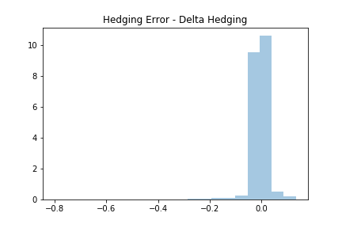
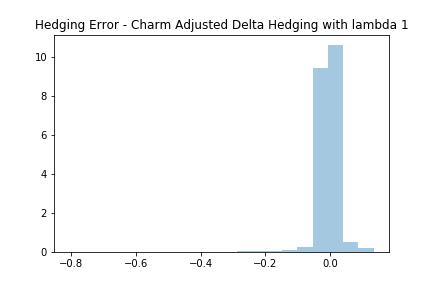
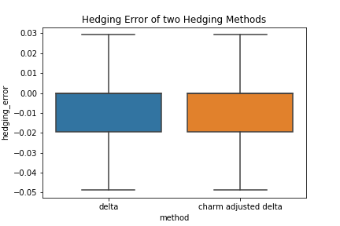

[](http://quantlet.de/)

## [](http://quantlet.de/) **charmAdjustedDeltaHedging** [](http://quantlet.de/)

```yaml

Name of QuantLet : 'charmAdjustedDeltaHedging'

Published in : 'SFM Class' 

Description : 'Hedge portfolios by delta hedging and charm adjusted delta hedging methods.'

Keywords : 'higher order greeks, greeks, hedging, delta hedging, charm adjusted delta hedging, neutral portfolio, simulation, monte carlo simulation, interactive plots'

Author : 'Christian Liegl Francis Liu Anna Shchekina'

Submitted : Mon, Feb 3 2020


```






