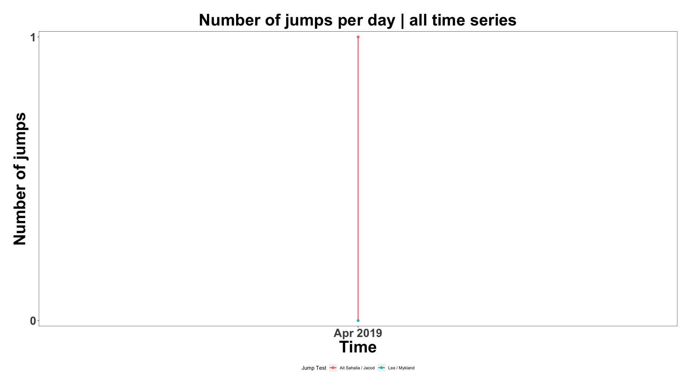

[](http://quantlet.de/)

## [](http://quantlet.de/) **JumpDetectR** [](http://quantlet.de/)

```yaml

Name of QuantLet : JumpDetectR

Published in : 'SFM / TBP in METIS'

Description : 'Scalable implementation of Lee / Mykland (2012) and Ait-Sahalia / Jacod (2012) Jump tests for noisy high frequency data; best used in combination with IRTG dataset (for access, ask IRTG 1792)'

Keywords : Jumps, jump test, high frequency, time series, Ait-Sahalia, Jacod, Lee, Mykland, stochastic processes, cryptocurrencies, crypto, spectogram

See also : 'Lee, S.S. and Mykland, P.A. (2012) Jumps in Equilibrium Prices and Market Microstructure Noise; Ait-Sahalia, Y. and Jacod, J. (2012) Analyzing the Spectrum of Asset Returns: Jump and Volatility Components in High Frequency Data'

Author : Danial Florian Saef

Submitted : February 12 2020 by Danial Saef
```



### R Code
```r

## install and load packages ##
libraries = c("data.table", "ggplot2", "scales")
lapply(libraries, function(x) if (!(x %in% installed.packages())) {install.packages(x)} )
invisible(lapply(libraries, library, quietly = TRUE, character.only = TRUE))
source("JumpDetectR_functions.R")
## ##

## settings ##
Sys.setenv(LANG = "en") # set environment language to English
Sys.setlocale("LC_TIME", "en_US.UTF-8") # set timestamp language to English
## ##

## Lee / Mykland Jump Test ##
DT_LM_result <- rbindlist(lapply(1:length(DT_split), function(x) {
  if (x %in% progress) {print(Sys.time()); print(progress[which(progress == x)])}
  LM_JumpTest(DT_split[[x]])
})
)
## 

## Ait-Sahalia / Jacod Jump Test ##
DT_AJ_result <- rbindlist(lapply(1:length(DT_split), function(x) {
  if (x %in% progress) {print(Sys.time()); print(progress[which(progress == x)])}
  AJ_JumpTest(DT_split[[x]])
})
)
##

DT_AJ_SJ <- unique(DT_AJ_result[!is.na(SJ)][SJ >= 1 & SJ < k^(p/2-1) ][, c("date", "id", "s", "p", "k", "delta")])[, Jump_indicator := 1]

sum_AJ_SJ <- unique(DT_AJ_SJ[!date %in% "2019-04-03" & Jump_indicator == 1, c("date", "id", "s", "p", "k", "delta", "Jump_indicator")])[ ,.N, by  = "date"]
sum_LM <- DT_LM_result[!id %in% "okex" & !date %in% "2019-04-03" & Jump_indicator == 1, c("date", "id", "s", "Jump_indicator")][, .N, by  = c("date", "s")]

N_AJ <- unique(DT_AJ_SJ[k == 2 & p == 4 & delta == 120][Jump_indicator == 1])[ ,.N, by  = "date"]

cmpre_jump <- data.table("date" = as.character(seq(from = as.Date(min(c(DT_AJ_result$date, DT_LM_result$date))), as.Date(max(c(DT_AJ_result$date, DT_LM_result$date))), by = "1 day")))
cmpre_jump[N_AJ, N_AJ := i.N, on = "date"]
cmpre_jump[sum_LM, N_LM := i.N, on = "date"]
cmpre_jump <- melt(cmpre_jump, id.vars = "date")
cmpre_jump[is.na(value), value := 0]

ggplot(cmpre_jump, aes(x=as.Date(date),xend=as.Date(date),y=0,yend=value, color = variable, group = variable)) +
  geom_segment(size = 1) +
  geom_point(cmpre_jump, mapping = aes(x= as.Date(date), y = value, color = variable, group = variable), size = 2) +
  plot_theme +
  labs(x = "Time", y = "Number of jumps",
       title = "Number of jumps per day | all time series", color = "Jump Test") +
  scale_x_date( expand=c(0.01,0.01),  labels = date_format("%b %Y")) +
  scale_y_discrete( expand=c(0.01,0.01), limits = c(0, max(cmpre_jump$value))) +
  scale_color_hue(labels = c("Ait Sahalia / Jacod", "Lee / Mykland")) +
  theme(plot.margin = unit(c(1,1,1,1), "cm")) +
  theme(panel.background = element_rect(fill = "transparent"), # bg of the panel
        plot.background = element_rect(fill = "transparent", color = NA), # bg of the plot
        panel.grid.major = element_blank(), # get rid of major grid
        panel.grid.minor = element_blank(), # get rid of minor grid
        legend.position = "bottom")# get rid of legend panel bg
```

automatically created on 2020-02-14