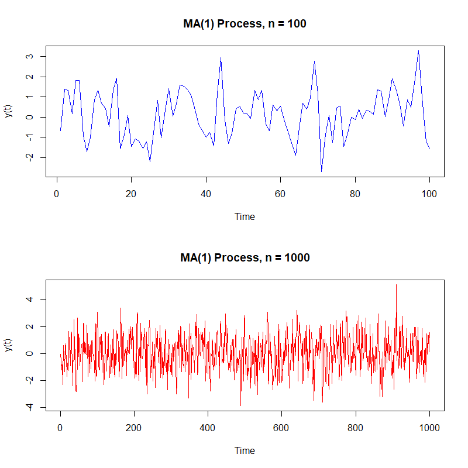

[](http://quantlet.de/)

## [](http://quantlet.de/) **SFEMA1_plotma1** [](http://quantlet.de/)

```yaml

Name of QuantLet: SFEMA1_plotma1

Published in: Statistics of Financial Markets

Description: 'Plots two realizations of an MA(1) (moving average) process with MA coefficient beta,  simulate from an arima model with innovations n1 and n2.'

Keywords: moving-average, stationary, linear, discrete, simulation, time-series, process, stochastic-process, stochastic, plot, graphical representation

Author: Ranqing Song

Submitted: January 29 2020 by Ranqing Song

Input: 
- n1, n2 : lags
- beta : moving average coefficient 


Example: 'An example is produced for beta=0.8, n1=100 and n2=1000.' 

```



### R Code
```r

# clear variables and close windows
rm(list = ls(all = TRUE))
graphics.off()

# install and load packages
libraries = c("stats")
lapply(libraries, function(x) if (!(x %in% installed.packages())) {
  install.packages(x)
})
lapply(libraries, library, quietly = TRUE, character.only = TRUE)

# parameter settings
n1   = 100
n2   = 1000
beta = 0.8

# simulation of MA(1)-processes
set.seed(123)
x1 = arima.sim(n = n1, list(ma = beta), innov = rnorm(n1))
x2 = arima.sim(n = n2, list(ma = beta), innov = rnorm(n2))

# Plot
par(mfrow = c(2, 1))
par(mfg = c(1, 1))
plot.ts(x1, col = "blue", ylab = "y(t)")
title(paste("MA(1) Process, n =", n1))
par(mfg = c(2, 1))
plot.ts(x2, col = "red", ylab = "y(t)")
title(paste("MA(1) Process, n =", n2))

```

automatically created on 2020-01-31