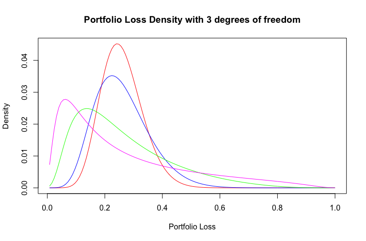

[](http://quantlet.de/)

## [](http://quantlet.de/) **TCopulaPortfolioLossDensity** [](http://quantlet.de/)

```yaml

Name of QuantLet : 'TCopulaPortfolioLossDensity'

Published in : 'SFM Class' 

Description : 'Computes the density function of the loss in a portfolio of bonds or other credit instruments using a one-factor t copula. The marginal densities of default times are implemented as poisson distributions using constant default intensities. After computing the portfolio loss densities for various values of the dependence parameter rho, these densities are plotted.'

Keywords : 'Copulae, Density plot, t distribution, simulation, gaussian copula, portfolio loss, credit risk, hazard rate'

Author : 'Kainat Khowaja and Vanessa Emanuela Guarino'
```



### R Code
```r

# clear variables and close windows
rm(list = ls(all = TRUE))
graphics.off()
#install.packages('invgamma')
library(invgamma)

df = 3
# Conditional Student t default probability
CondDefaultProbGauss = function(rho, market.factor, default.time, hazard.rate) {
  # Determine default probability from hazard rate
  dp = drop(1 - exp(-hazard.rate * default.time))
  df = 3
  # Determine quantile for probability in student t distribution with 3 d.o.f
  t.quantile = qt(dp, df, lower.tail = TRUE, log.p = FALSE)
  
  # Determine value of student t random variable according to factor model
  u = (t.quantile - sqrt(rho) * market.factor)/sqrt(1 - rho)
  
  # Return conditional student t default probability
  #pnorm(u,mean=0, sd=1, lower.tail = TRUE, log.p = FALSE)
  pt(u, df, lower.tail = TRUE, log.p = FALSE)
}

# Conditional probability for pool loss rate of n/M
CondPoolLossProb = function(rho, market.factor, default.time, hazard.rate, number.defaults, 
                            entities) {
  sapply(X = market.factor, FUN = function(market.factor, rho, default.time, 
                                           hazard.rate, number.defaults, entities) {
    # Compute pool loss probability conditional on market factor
    cond.pool.loss.prob = dbinom(x = number.defaults, size = entities, prob = CondDefaultProbGauss(rho, 
                                                                                                   market.factor, default.time, hazard.rate), log = FALSE)
    
    # Compute the market factor probability
    market.factor.prob = dnorm(market.factor, mean = 0, sd = 1, log = FALSE)
    #market.factor.prob = dt(market.factor,3, log = FALSE)
    
    return(cond.pool.loss.prob * market.factor.prob)
  }, rho = rho, default.time = default.time, hazard.rate = hazard.rate, number.default = number.defaults, 
  entities = entities)
}

# Unconditional probability for pool loss rate of n/M
PoolLossProb = function(rho, default.time, hazard.rate, number.defaults, entities) {
  integrate(f = CondPoolLossProb, lower = -Inf, upper = Inf, rho = rho, default.time = default.time, 
            hazard.rate = hazard.rate, number.defaults = number.defaults, entities = entities, 
            rel.tol = 1e-12, stop.on.error = FALSE)[[1]]
}

# Model parameters
rho.parameters = c(0.05, 0.1, 0.3, 0.5)
entities = 125
number.defaults = 1:entities
hazard.rate = 0.06
maturity = 5
default.percentage = number.defaults/entities

densities = sapply(X = rho.parameters, FUN = function(rho) {
  density = sapply(X = number.defaults, FUN = PoolLossProb, rho = rho, default.time = maturity, 
                   hazard.rate = hazard.rate, entities = entities)
  return(density)
})

# plot
par(bg="transparent")
plot(x = default.percentage, y = densities[, 1], main = paste("Portfolio Loss Density with", df, "degrees of freedom",sep=" " ), type = "l", xlab = "Portfolio Loss", 
     ylab = "Density", col = "red")
lines(x = default.percentage, y = densities[, 2], col = "blue")
lines(x = default.percentage, y = densities[, 3], col = "green")
lines(x = default.percentage, y = densities[, 4], col = "magenta")


```

automatically created on 2020-02-03